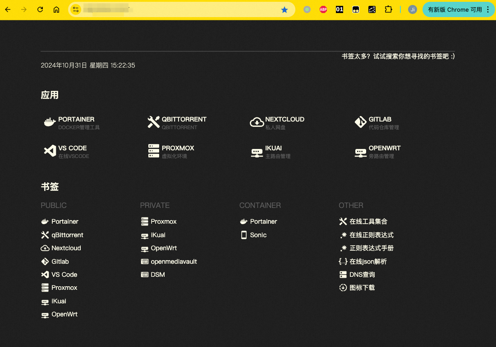

# nas

## 准备工作

1. 一台all in one的nas主机，可以是pve、esxi、kvm等
2. 公网ip（电信可联系运营商开放公网ip）
3. 域名（需要配置cname记录"*"解析到本域名）

## 宿主机

### pve

1. 配置ip（10.10.10.254/24），网关（10.10.10.252），dns（10.10.10.252）
2. 安装omv、ikuai、openwrt虚拟机

## 虚拟机

### ikuai

1. 配置ip（10.10.10.253）
2. 配置dns（114.114.114.114，8.8.8.8）
3. 配置dhcp，客户端（10.10.10.0/24），网关（10.10.10.252），dns（10.10.10.252，10.10.10.253）
4. 配置拨号
5. 配置ddns
6. 配置端口映射，把需要暴露的接口映射到外网

### openwrt

1. 配置ip（10.10.10.252/24），网关（10.10.10.253），dns（114.114.114.114，8.8.8.8），忽略dhcp
2. 配置frpc
3. 配置passwall2
4. 配置vpn

### omv

1. 配置ip（10.10.10.1/24），网关（10.10.10.252），dns（10.10.10.252）
2. 配置用户
3. 配置文件系统
4. 配置各类文件系统服务（smb、nfs、 ...）
5. 使用本项目一键搭建nextcloud等环境

#### 部署

##### 部署docker容器

先按照[文档](https://github.com/ice-black-tea/linktools-cntr/blob/master/README.md)安装Docker、Python3等环境，然后按照以下命令部署Docker容器

第一次安装：
```
# 添加代码仓库（提示添加成功或者仓库已存在均是预期内的结果，可继续后续步骤）
ct-cntr repo add https://github.com/ice-black-tea/cntr-homelab

# 添加容器
# omv中包含了（nextcloud、flare、qbittorrent），其他的像vscode、gitlab按需添加
ct-cntr add omv gitlab portainer vscode

# 配置主域名和acme，用于自动生成ssl证书
# ACME_DNS_API参数为dnsapi类型，比如用的阿里云的dns就填dns_ali，顺带配上Ali_Key和Ali_Secret参数
# 具体可参考：https://github.com/acmesh-official/acme.sh/wiki/dnsapi
ct-cntr config set \
    ROOT_DOMAIN=test.com \
    ACME_DNS_API=dns_ali \
    Ali_Key=xxx \
    Ali_Secret=yyy

# 启动容器
ct-cntr up
```

后续升级版本执行以下命令更新即可：
```
# 更新脚本版本和代码仓库
ct-cntr update

# 启动容器
ct-cntr up
```

##### 配置docker延迟加载

避免开机时未挂载硬盘的时候就加载容器，导致容器加载失败，通过以下命令编辑延迟启动docker：

```
SYSTEMD_EDITOR="vim" systemctl edit docker.service
```

添加以下配置实现延迟启动:

```
[Unit]
ExecStartPre=/bin/sleep 60
```

## 最终效果


